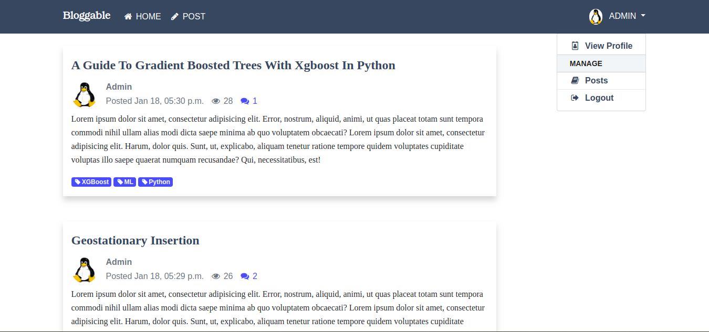
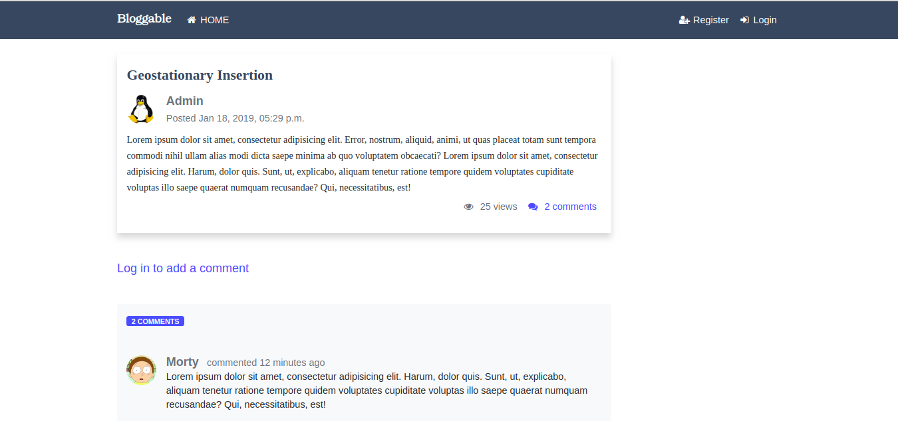

# Bloggable
A full-featured blog with Django framework. I consider this project to be an advanced hello world in Django. So if you are completely new to Django, you might want to hang out on the [Django website](https://docs.djangoproject.com) a little while before coming back here.



## Installation
Assuming you have Python 3 et Django installed, __Bloggable__ is easy to install and deploy. If not proceed to [Python Setup and Usage](https://docs.python.org/3/using/index.html) page to install Python 3 and [How to install Django](https://docs.djangoproject.com/en/2.1/topics/install/) page to install Django. However if you are running a Linux system on your computer, you probably already have Python intsalled. Just run `python --version` in your terminal to check it. If you do have Python installed then just run `pip install Django` in your terminal to install Django and you are good to go.  
Now, to to get __Bloggable__ up and running on your computer, follow these steps:

### 1. Clone the repository
```
git clone https://github.com/kakiang/bloggable.git
```
### 2. Create a virtual environment
```
python -m venv bloggable_env

source bloggable_env/bin/activate
```
If you are using Windows you should run the activate script directly from the command shell. You shouldn't run `source bloggable_env/bin/activate`.

The above commands will create a virtual environment in the `bloggable_env` folder. As a reminder, a virtual environment is a an isolated Python environment that allows packages to be installed and to be used in a particular project. The packages installed in a virtual environmennt are not  installed system wide. That means, to be able to use those packages we have to switch to the virtual environment in which they are installed. That's what it's done with this command `source bloggable_env/bin/activate`. Virtual environment is a solution to potential dependency conflicts between the different projects that you may have. It's a good practice. But it's optional, as long as you don't have depedenncy conflicts.  

### 3. Install depedencies

Once you've created and activated your virtual environment, you are now ready to install the project dependencies. Move to the __bloggable__ root directory and run `pip install -r requirements.txt` in your terminal.
```
cd bloggable/

pip install -r requirements.txt
```
 This command will install all the packages that __bloggable__ project uses. They are listed in the [requirements.txt](https://github.com/kakiang/bloggable/blob/master/requirements.txt) file, as well as the versions that have been used.

 ## Usage

 Once everything is set (just follow what's outlined above and it'll be fine, if not just raise an issue), it's time to run python server. And this is easily done with `python manage.py runserver`. `manage.py` is a file at the the project's root directory. It's technically a command-line utility that allows us to perform operations on our Django web app, operations such as creating apps, making migrations, running the development server, etc. Here we're using it to run a development server. The command will output something like
 ```
python manage.py runserver

Performing system checks...

System check identified no issues (0 silenced).
January 25, 2019 - 09:48:36
Django version 2.1, using settings 'bloggable.settings'
Starting development server at http://127.0.0.1:8000/
Quit the server with CONTROL-C.
```
Then just go to http://127.0.0.1:8000/ to access __Bloggable__. Or whatever your IP is.

Notice the db.sqlite3 file is not empty. There are some mock data in the database. the admin username is `Admin` and password `testing221`. There is a second user with `Morty` as username and `testing221` as password.

## Features
- List posts
- Add posts
- Display post detail
- Update and Delete posts
- Add Comments
- Authentication
- User registration
- Tags
- pagination
- Search
- Rich Text-Editor
- RSS Feed
- Clap (like) posts


Enjoy Django!!!


