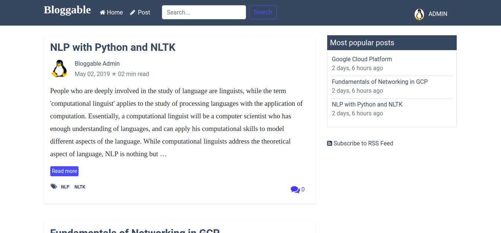

# Bloggable  

[](https://opensource.org/licenses/MIT) 
[](https://travis-ci.org/kakiang/bloggable) [](https://codecov.io/gh/kakiang/bloggable)

A full-featured blog with Django framework. I consider this project to be an advanced hello world in Django. So if 
you are completely new to Django, you might want to hang out on the [Django website](https://docs.djangoproject.com) a 
little while before coming back here.



<!--  -->

## Installation
Assuming you have Python 3 et Django installed, __Bloggable__ is easy to install and deploy. If not proceed to 
[Python Setup and Usage](https://docs.python.org/3/using/index.html) page to install Python 3 and 
[How to install Django](https://docs.djangoproject.com/en/2.1/topics/install/) page to install Django. 
However if you are running a Linux system on your computer, you probably already have Python intsalled. Just run 
`python --version` in your terminal to check it. If you do have Python installed then just run `pip install Django` 
in your terminal to install Django and you are good to go.  
Now, to to get __Bloggable__ up and running on your computer, follow these steps:

### 1. Clone the repository
```
git clone https://github.com/kakiang/bloggable.git
```
### 2. Create a virtual environment
```
python -m venv bloggable_env

source bloggable_env/bin/activate
```
If you are using Windows you should run the activate script directly from the command shell. You shouldn't 
run `source bloggable_env/bin/activate`.

The above commands will create a virtual environment in the `bloggable_env` folder. As a reminder, a virtual 
environment is an isolated Python environment that allows packages to be installed and to be used in a particular project. 
The packages installed in a virtual environment are not  installed system wide. That means, to be able to use those 
packages we have to switch to the virtual environment in which they are installed. That's what it's done with this 
command `source bloggable_env/bin/activate`. Virtual environment is a solution to potential dependency conflicts between 
python packages that one may use in ones projects. For example, if you are using python 2.7 for a project and 
python 3.7 for another project, you will need to create virtual environments to be able to have two different versions 
of python installed in your machine. It's a good practice. But it's optional, as long as you don't have dependency conflicts.

If you have `anaconda` or `miniconda` installed, it's kinda intuitive to `create`, `activate` and `deactivate` 
a virtual environment:

To create a new virtual environment named `bloggable_env` run the following:
```bash
$ conda create --name bloggable_env
```  

To activate the new environment to use it

```bash
$ conda activate bloggable_env
```
On older versions of `anaconda/miniconda` use 

```
$ source activate bloggable_env
```

On windows

```bash
$ activate bloggable_env
```

To deactivate the current environment

```bash
$ conda deactivate
```

### 3. Install dependencies

Once you've created and activated your virtual environment, you are now ready to install the project dependencies. 
Move to the __bloggable__ root directory and run `pip install -r requirements.txt` in your terminal.
```
$ cd bloggable/

$ pip install -r requirements.txt
```
 This command will install all the packages that __bloggable__ project uses. They are listed in the 
 [requirements.txt](https://github.com/kakiang/bloggable/blob/master/requirements.txt) file, as well as the versions 
 that have been used.

 ## Usage

 Once everything is set (just follow what's outlined above and it'll be fine, if not just raise an issue), it's time 
 to start the development server. And this is easily done with `python manage.py runserver`. `manage.py` is a file at 
 the the project's root directory. It's technically a command-line utility that allows us to perform operations on our 
 Django web app, operations such as creating apps, making migrations, running the development server, etc. 
 
 But before starting the development server let's create the models first. In other words we have to run migrations:

Run the following command to apply the new migration
```
$ python manage.py makemigrations
``` 
This command creates a python file to register the changes made to the class models.

Then run `
```
$ python manage.py migrate
``` 
to migrate the database. Django uses `sqlite` as database system by default.
 
 Start the development server with the following command:

 ```
$ python manage.py runserver
```
The command will output something like

```
Performing system checks...

System check identified no issues (0 silenced).
May 06, 2019 - 18:42:22
Django version 2.2, using settings 'bloggable.dev_settings'
Starting development server at http://127.0.0.1:8000/
Quit the server with CONTROL-C.
```
Then just visit http://127.0.0.1:8000/ to access __Bloggable__. Or whatever your IP is.

Django has a built-in admin module. Visit http://127.0.0.1:8000/admin/ to access it. But you need to create a 
superuser to access the admin site. Run the following command to create that user:

```
$ python manage.py createsuperuser
```

Enter your desired username and press enter.

```
Username: admin
```

You will then be prompted for your email address:

```
Email address: admin@example.com
```
The final step is to enter your password. You will be asked to enter your password twice, the second time as a 
confirmation of the first.

```
Password: **********
Password (again): *********
Superuser created successfully.
```
Now open a Web browser and go to http://127.0.0.1:8000/admin/. 


<!-- Notice the db.sqlite3 file is not empty. There are some mock data in the database. the admin username is `Admin` 
and password `testing221`. There is a second user with `Morty` as username and `testing221` as password. -->

## Features
- List posts
- Add posts
- Display post detail
- Update and Delete posts
- Add Comments
- Authentication
- User registration
- Tags
- pagination
- Search
- Rich Text-Editor
- RSS Feed
<!-- - Clap (like) posts -->


Enjoy Django!!!
